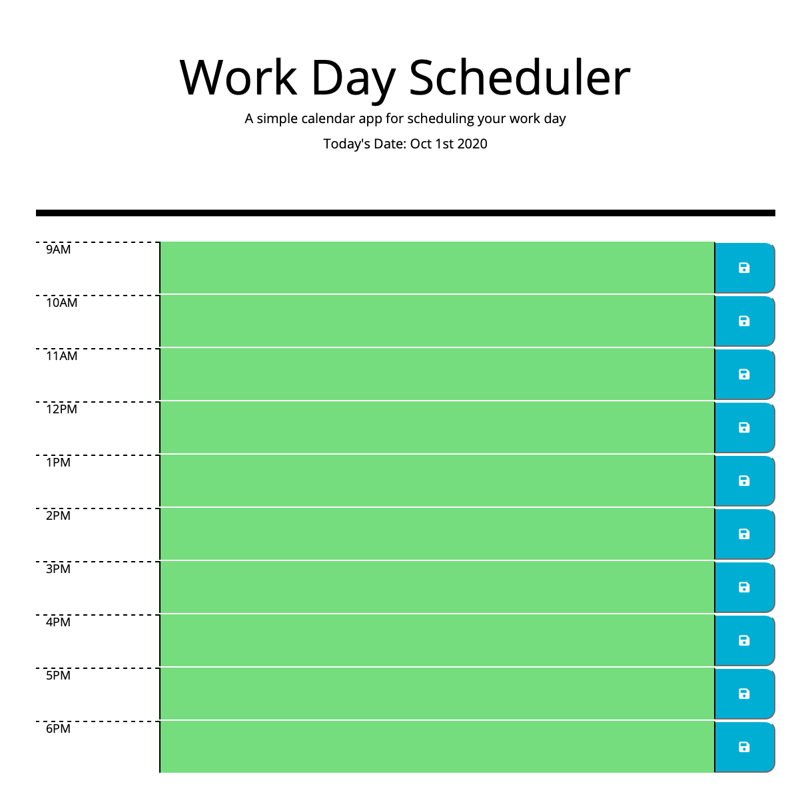
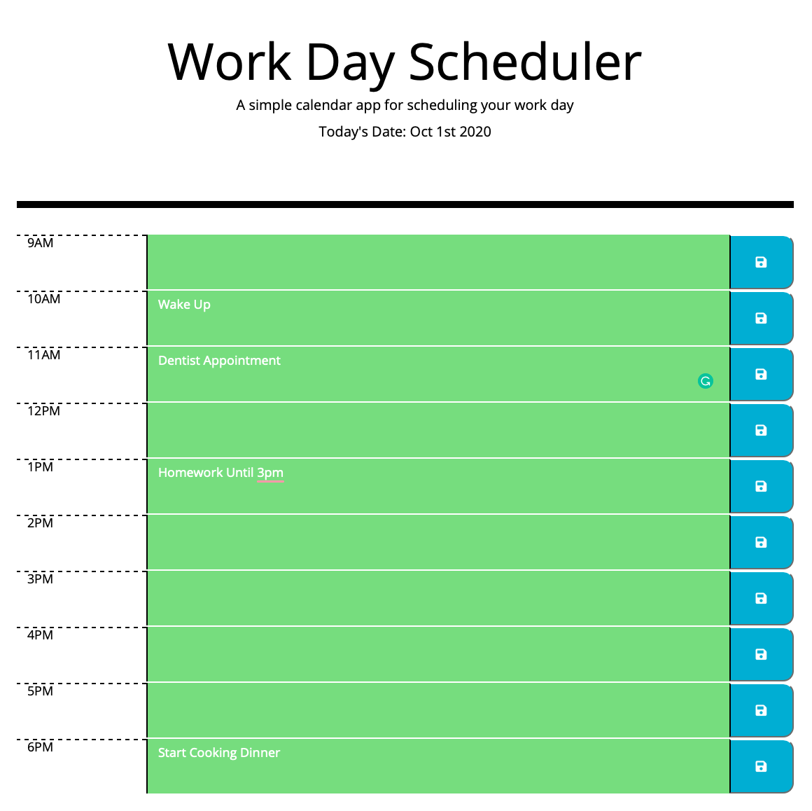

# Work Day Scheduler

In this assignment, I created a very simple interactive scheduler. To use it, the user must type out their tasks in the respective time block and click the blue save button to save the data onto the page. When the user needs to revisit the schedule, they can go back to the page where their information is saved. 

This assignment was created with JavaScript. I used "moment" in JavaScript to manipulate the dates and time.

Live link: https://avatl.github.io/schedule-hw5/